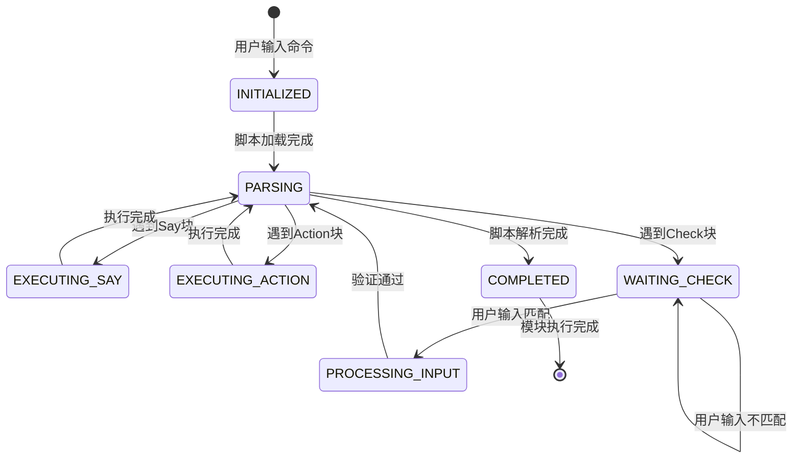

# Claude Code 课程系统技术架构

## 概述

本文档说明课程系统的两个核心技术实现：

1. 命令路由系统的快速响应机制
2. 交互式教学脚本的执行引擎

---

## 一、命令路由系统

### 架构设计

采用**预置指令文件 + 配置驱动路由**的架构，实现零延迟命令响应。

### 文件结构

```text
course-materials/
├── .claude/
│   └── commands/
│       ├── start-1-1.md
│       ├── start-1-2.md
│       └── ... (10个命令文件)
└── course-structure.json
```

### 执行流程

```text
用户输入: /start-1-2
    │
    ├─> 1. 命令解析
    │     提取模块ID: "1.2"
    │
    ├─> 2. 读取命令文件
    │     .claude/commands/start-1-2.md
    │
    ├─> 3. 查询配置表
    │     course-structure.json
    │     └─> 获取 path: "lesson-modules/1.2-visualizing-files/CLAUDE.md"
    │
    └─> 4. 加载教学脚本
          执行 CLAUDE.md
```

### 性能优势

**传统AI响应流程：**

```text
用户输入 → LLM推理 → 意图理解 → 任务规划 → 执行
耗时: 3-5秒
```

**本系统流程：**

```text
用户输入 → 文件查找 → 配置查询 → 脚本加载 → 执行
耗时: <2秒
```

**关键优化点：**

- 预置指令文件：消除LLM推理延迟
- 标准化路由：O(1)配置查询
- 直接文件I/O：无网络请求

### 技术实现

**命令文件格式：**

```markdown
启动 Claude Code PM 课程模块 1.2：可视化文件

1. 解析命令名称以提取模块 ID：
   - 命令名称："start-1-2" → 模块 ID："1.2"

2. 读取 `course-structure.json` 以查找具有此 ID 的模块

3. 从配置中获取模块的教学脚本路径（"path" 字段）

4. 读取该 CLAUDE.md 文件 - 这是您的教学脚本

5. 严格按照 SCRIPT_INSTRUCTIONS.md 中的说明遵循教学脚本
```

**配置表结构：**

```json
{
  "modules": [
    {
      "id": "1.2",
      "title": "可视化文件",
      "path": "lesson-modules/1.2-visualizing-files/CLAUDE.md",
      "command": "start-1-2"
    }
  ]
}
```

---

## 二、交互式教学脚本引擎

### 引擎架构

采用**脚本化执行 + 状态机控制流**的架构，确保教学流程的一致性和可控性。

### 脚本结构

教学脚本（CLAUDE.md）包含三种指令类型：

#### 1. Say 块 - 文本输出

```markdown
**Say:**
"欢迎来到模块1.2！今天我们要学习..."
```

- 执行方式：逐字输出
- 用途：教学内容展示

#### 2. Action 块 - 操作执行

```markdown
**Action:**
列出当前目录的所有文件
```

- 执行方式：调用工具函数
- 用途：演示操作

#### 3. Check 块 - 流程控制

```markdown
**Check:** 等待学员说"准备好了"
```

- 执行方式：暂停执行，等待用户输入
- 用途：交互检查点

### 执行状态机

#### 状态定义

状态机包含以下核心状态：

```typescript
enum ScriptState {
  INITIALIZED,      // 初始化：加载脚本和配置
  PARSING,          // 解析中：解析脚本块
  EXECUTING_SAY,    // 执行Say块：输出文本
  EXECUTING_ACTION, // 执行Action块：调用工具
  WAITING_CHECK,    // 等待检查点：暂停等待用户输入
  PROCESSING_INPUT, // 处理用户输入：验证并继续
  COMPLETED,        // 完成：模块执行结束
  ERROR             // 错误：执行异常
}
```

#### 状态转换规则

**状态转换表：**

| 当前状态 | 触发条件 | 下一状态 | 执行动作 |
|---------|---------|---------|---------|
| INITIALIZED | 脚本加载完成 | PARSING | 开始解析脚本 |
| PARSING | 遇到Say块 | EXECUTING_SAY | 提取Say内容 |
| PARSING | 遇到Action块 | EXECUTING_ACTION | 提取Action指令 |
| PARSING | 遇到Check块 | WAITING_CHECK | 设置检查条件 |
| EXECUTING_SAY | Say块执行完成 | PARSING | 继续解析下一个块 |
| EXECUTING_ACTION | Action块执行完成 | PARSING | 继续解析下一个块 |
| WAITING_CHECK | 用户输入匹配 | PROCESSING_INPUT | 验证输入 |
| WAITING_CHECK | 用户输入不匹配 | WAITING_CHECK | 保持等待 |
| PROCESSING_INPUT | 输入验证通过 | PARSING | 继续解析 |
| PARSING | 脚本解析完成 | COMPLETED | 结束执行 |
| * | 发生错误 | ERROR | 错误处理 |

#### 状态机可视化

**Mermaid 状态图：**



**状态轮转 ASCII 图：**

```text
                    ┌─────────────┐
                    │ INITIALIZED │  初始状态：加载脚本和配置
                    └──────┬──────┘
                           │
                           ▼
                    ┌─────────────┐
                    │   PARSING   │  ←────────────────┐
                    │  (核心状态) │                    │
                    └──────┬──────┘                    │
                           │                           │
        ┌──────────────────┼──────────────────┐       │
        │                  │                  │       │
        ▼                  ▼                  ▼       │
┌──────────────┐  ┌──────────────┐  ┌──────────────┐ │
│EXECUTING_SAY │  │EXECUTING_    │  │WAITING_CHECK │ │
│              │  │ACTION        │  │              │ │
│ 输出文本内容 │  │ 调用工具函数 │  │ 等待用户输入 │ │
└──────┬───────┘  └──────┬───────┘  └──────┬───────┘ │
       │                 │                 │         │
       │                 │                 │         │
       └─────────────────┴─────────────────┘         │
                      │                               │
                      ▼                               │
              ┌──────────────┐                        │
              │PROCESSING_   │                        │
              │INPUT         │                        │
              │ 验证用户输入  │                        │
              └──────┬───────┘                        │
                     │                                │
                     └────────────────────────────────┘
                                │
                                ▼
                         ┌─────────────┐
                         │  COMPLETED  │  终止状态：模块执行完成
                         └─────────────┘
```

**状态轮转示例（完整循环）：**

```text
执行Say块循环：
┌─────────┐    遇到Say块    ┌──────────────┐    执行完成    ┌─────────┐
│ PARSING │ ──────────────▶ │EXECUTING_SAY │ ─────────────▶ │ PARSING │
└─────────┘                 └──────────────┘                 └─────────┘
     ▲                                                              │
     │                                                              │
     └──────────────────────────────────────────────────────────────┘
                            (继续解析下一个块)

执行Action块循环：
┌─────────┐   遇到Action块  ┌──────────────┐    执行完成    ┌─────────┐
│ PARSING │ ──────────────▶ │EXECUTING_    │ ─────────────▶ │ PARSING │
│         │                 │ACTION        │                 │         │
└─────────┘                 └──────────────┘                 └─────────┘
     ▲                                                              │
     │                                                              │
     └──────────────────────────────────────────────────────────────┘
                            (继续解析下一个块)

用户交互循环：
┌─────────┐   遇到Check块   ┌──────────────┐   用户输入匹配 ┌──────────────┐
│ PARSING │ ──────────────▶ │WAITING_CHECK │ ─────────────▶ │PROCESSING_   │
└─────────┘                 └──────────────┘                 │INPUT         │
     ▲                                                         └──────┬───────┘
     │                                                                 │
     │                                                         验证通过 │
     │                                                                 ▼
     └──────────────────────────────────────────────────────────┌─────────┐
                                                                │ PARSING │
                                                                └─────────┘

完成路径：
┌─────────┐   脚本解析完成   ┌─────────────┐
│ PARSING │ ──────────────▶ │  COMPLETED  │
└─────────┘                 └─────────────┘
```

**状态说明：**

- **PARSING**：核心状态，所有执行路径的枢纽，形成循环
- **EXECUTING_SAY**：执行文本输出，完成后回到PARSING
- **EXECUTING_ACTION**：执行工具调用，完成后回到PARSING
- **WAITING_CHECK**：暂停状态，等待用户输入，可自循环
- **PROCESSING_INPUT**：处理用户输入，验证后回到PARSING
- **COMPLETED**：终止状态，模块执行完成

**关键轮转模式：**

1. **主循环路径**：PARSING → EXECUTING_SAY/ACTION → PARSING（执行块循环）
2. **交互路径**：PARSING → WAITING_CHECK → PROCESSING_INPUT → PARSING（用户交互循环）
3. **完成路径**：PARSING → COMPLETED（终止）

#### 状态机实现伪代码

```typescript
class ScriptExecutor {
  private state: ScriptState = ScriptState.INITIALIZED;
  private script: ScriptBlock[];
  private currentIndex: number = 0;
  private context: ExecutionContext;

  async execute(scriptPath: string): Promise<void> {
    // 1. 初始化状态
    this.state = ScriptState.INITIALIZED;
    this.script = await this.loadScript(scriptPath);
    this.context = await this.loadContext();
    
    // 2. 开始解析
    this.state = ScriptState.PARSING;
    
    while (this.currentIndex < this.script.length) {
      const block = this.script[this.currentIndex];
      
      switch (block.type) {
        case 'Say':
          await this.executeSayBlock(block);
          break;
        case 'Action':
          await this.executeActionBlock(block);
          break;
        case 'Check':
          await this.executeCheckBlock(block);
          break;
      }
      
      this.currentIndex++;
    }
    
    this.state = ScriptState.COMPLETED;
  }

  private async executeSayBlock(block: SayBlock): Promise<void> {
    this.state = ScriptState.EXECUTING_SAY;
    
    // 变量替换
    const content = this.replaceVariables(block.content);
    
    // 逐字输出
    await this.output(content);
    
    // 返回解析状态
    this.state = ScriptState.PARSING;
  }

  private async executeActionBlock(block: ActionBlock): Promise<void> {
    this.state = ScriptState.EXECUTING_ACTION;
    
    // 解析指令
    const command = this.parseCommand(block.instruction);
    
    // 执行工具调用
    const result = await this.invokeTool(command);
    
    // 返回解析状态
    this.state = ScriptState.PARSING;
  }

  private async executeCheckBlock(block: CheckBlock): Promise<void> {
    this.state = ScriptState.WAITING_CHECK;
    
    // 设置检查条件
    const condition = block.condition;
    
    // 等待用户输入
    while (true) {
      const userInput = await this.waitForInput();
      
      // 验证输入
      if (this.matchCondition(userInput, condition)) {
        this.state = ScriptState.PROCESSING_INPUT;
        await this.processInput(userInput);
        this.state = ScriptState.PARSING;
        break;
      } else {
        // 保持等待状态
        await this.promptRetry();
      }
    }
  }
}
```

#### 多轮对话执行示例

以下展示一个完整的多轮对话场景，展示状态机如何在不同状态间转换：

##### 对话场景：学员学习模块1.1

```text
┌─────────────────────────────────────────────────────────────┐
│ 轮次1: 用户输入命令                                          │
├─────────────────────────────────────────────────────────────┤
│ 用户: /start-1-1                                            │
│                                                              │
│ [状态: INITIALIZED]                                         │
│ → 加载脚本: lesson-modules/1.1-welcome/CLAUDE.md           │
│ → 加载配置: course-structure.json                           │
│ → 计算动态变量: {moduleId}="1.1", {moduleTitle}="欢迎"     │
│                                                              │
│ [状态转换: INITIALIZED → PARSING]                          │
└─────────────────────────────────────────────────────────────┘

┌─────────────────────────────────────────────────────────────┐
│ 轮次2: 执行Say块                                             │
├─────────────────────────────────────────────────────────────┤
│ [状态: PARSING]                                             │
│ → 解析到Say块                                                │
│                                                              │
│ [状态转换: PARSING → EXECUTING_SAY]                        │
│                                                              │
│ Claude输出:                                                  │
│ "欢迎来到 Claude Code PM 课程! 🎉                          │
│                                                              │
│ 看看你。在终端里。无所畏惧。准备大干一场。                   │
│ 我是 Claude,将担任你整个课程的讲师...                      │
│                                                              │
│ 当你准备好了解更多关于 SingTech 的信息时,                   │
│ 只需说: '告诉我关于 SingTech 的信息'"                        │
│                                                              │
│ [状态转换: EXECUTING_SAY → PARSING]                        │
│                                                              │
│ [状态: PARSING]                                             │
│ → 解析到Check块                                              │
│                                                              │
│ [状态转换: PARSING → WAITING_CHECK]                        │
└─────────────────────────────────────────────────────────────┘

┌─────────────────────────────────────────────────────────────┐
│ 轮次3: 等待用户输入（状态机暂停）                             │
├─────────────────────────────────────────────────────────────┤
│ [状态: WAITING_CHECK]                                       │
│ → 检查条件: 等待学员询问 SingTech                           │
│ → 状态机暂停，等待用户输入                                    │
│                                                              │
│ [用户输入: "告诉我关于 SingTech 的信息"]                     │
│                                                              │
│ [状态转换: WAITING_CHECK → PROCESSING_INPUT]               │
│ → 验证输入: 匹配成功                                          │
│                                                              │
│ [状态转换: PROCESSING_INPUT → PARSING]                     │
└─────────────────────────────────────────────────────────────┘

┌─────────────────────────────────────────────────────────────┐
│ 轮次4: 执行Say块（继续教学）                                  │
├─────────────────────────────────────────────────────────────┤
│ [状态: PARSING]                                             │
│ → 解析到Say块（条件分支：当学员询问时）                       │
│                                                              │
│ [状态转换: PARSING → EXECUTING_SAY]                        │
│                                                              │
│ Claude输出:                                                  │
│ "太好了!让我告诉你关于 SingTech 的信息。                     │
│                                                              │
│ SingTech 概述:                                              │
│ - 它是什么: K歌娱乐科技公司...                              │
│ - 阶段: B 轮初创公司...                                     │
│                                                              │
│ 当你准备好查看我们正在使用的文件时,                          │
│ 只需说: '给我看看 SingTech 的文件'"                         │
│                                                              │
│ [状态转换: EXECUTING_SAY → PARSING]                        │
│                                                              │
│ [状态: PARSING]                                             │
│ → 解析到Check块                                              │
│                                                              │
│ [状态转换: PARSING → WAITING_CHECK]                        │
└─────────────────────────────────────────────────────────────┘

┌─────────────────────────────────────────────────────────────┐
│ 轮次5: 用户请求查看文件                                       │
├─────────────────────────────────────────────────────────────┤
│ [状态: WAITING_CHECK]                                       │
│ → 检查条件: 等待学员请求查看文件                              │
│                                                              │
│ [用户输入: "给我看看 SingTech 的文件"]                      │
│                                                              │
│ [状态转换: WAITING_CHECK → PROCESSING_INPUT]               │
│ → 验证输入: 匹配成功                                          │
│                                                              │
│ [状态转换: PROCESSING_INPUT → PARSING]                     │
│                                                              │
│ [状态: PARSING]                                             │
│ → 解析到Say块（条件分支：当学员询问时）                       │
│                                                              │
│ [状态转换: PARSING → EXECUTING_SAY]                        │
│                                                              │
│ Claude输出:                                                  │
│ "完美!我将搜索 SingTech 课程目录中的可用文件..."            │
│                                                              │
│ [状态转换: EXECUTING_SAY → PARSING]                        │
│                                                              │
│ [状态: PARSING]                                             │
│ → 解析到Action块                                             │
│                                                              │
│ [状态转换: PARSING → EXECUTING_ACTION]                     │
└─────────────────────────────────────────────────────────────┘

┌─────────────────────────────────────────────────────────────┐
│ 轮次6: 执行Action块（工具调用）                               │
├─────────────────────────────────────────────────────────────┤
│ [状态: EXECUTING_ACTION]                                    │
│ → 解析指令: "使用 ls -la 命令显示目录结构"                    │
│ → 调用工具: run_terminal_cmd("ls -la ../company-context/") │
│                                                              │
│ 工具执行结果:                                                │
│ COMPANY.md                                                   │
│ PRODUCT.md                                                   │
│ PERSONAS.md                                                  │
│ COMPETITIVE.md                                               │
│                                                              │
│ [状态转换: EXECUTING_ACTION → PARSING]                     │
│                                                              │
│ [状态: PARSING]                                             │
│ → 解析到Say块（格式化输出）                                   │
│                                                              │
│ [状态转换: PARSING → EXECUTING_SAY]                        │
│                                                              │
│ Claude输出:                                                  │
│ "这是我在 SingTech 目录中找到的内容:                        │
│                                                              │
│ 公司背景文件:                                                │
│ - COMPANY.md - 公司概述和你的角色                            │
│ - PRODUCT.md - SingTech 的功能和关键特性                     │
│ ..."                                                         │
│                                                              │
│ [状态转换: EXECUTING_SAY → PARSING]                        │
│                                                              │
│ [状态: PARSING]                                             │
│ → 解析到Check块                                              │
│                                                              │
│ [状态转换: PARSING → WAITING_CHECK]                        │
└─────────────────────────────────────────────────────────────┘

┌─────────────────────────────────────────────────────────────┐
│ 轮次7: 模块完成                                              │
├─────────────────────────────────────────────────────────────┤
│ [状态: WAITING_CHECK]                                       │
│ → 用户输入: "给我一个总结"                                   │
│                                                              │
│ [状态转换: WAITING_CHECK → PROCESSING_INPUT]               │
│ [状态转换: PROCESSING_INPUT → PARSING]                     │
│                                                              │
│ [状态: PARSING]                                             │
│ → 解析到Say块                                                │
│ → 执行Say块...                                              │
│ → 继续解析...                                                │
│ → 脚本解析完成                                                │
│                                                              │
│ [状态转换: PARSING → COMPLETED]                            │
│                                                              │
│ [状态: COMPLETED]                                           │
│ → 模块执行完成                                                │
│ → 清理资源                                                    │
└─────────────────────────────────────────────────────────────┘
```

**状态转换统计：**

- INITIALIZED → PARSING: 1次
- PARSING → EXECUTING_SAY: 4次
- EXECUTING_SAY → PARSING: 4次
- PARSING → EXECUTING_ACTION: 1次
- EXECUTING_ACTION → PARSING: 1次
- PARSING → WAITING_CHECK: 3次
- WAITING_CHECK → PROCESSING_INPUT: 3次
- PROCESSING_INPUT → PARSING: 3次
- PARSING → COMPLETED: 1次

**关键观察：**

1. **状态机循环**：PARSING 是核心状态，所有执行路径最终都回到 PARSING
2. **用户交互**：WAITING_CHECK 状态允许状态机暂停，等待用户输入
3. **确定性**：相同脚本和用户输入产生相同的状态转换序列
4. **可恢复性**：状态机可以在任何 Check 点暂停和恢复

#### 状态机特性

##### 1. 确定性执行

- 状态转换完全由脚本内容决定
- 无随机性或不确定性
- 相同脚本产生相同执行轨迹

##### 2. 可中断性

- Check块提供明确的暂停点
- 支持用户交互和异步输入
- 状态可持久化，支持恢复

##### 3. 错误恢复

- 每个状态都有错误处理
- 错误状态可回退到上一个稳定状态
- 支持跳过无效块继续执行

##### 4. 上下文保持

- 执行上下文在状态转换间保持
- 变量替换结果可缓存
- 用户输入历史可追踪

#### 性能优化

**状态缓存：**

- 脚本解析结果缓存，避免重复解析
- 变量替换结果缓存，减少重复计算
- 配置数据缓存，减少文件I/O

**异步执行：**

- Say块输出异步化，不阻塞解析
- Action块工具调用异步化
- Check块等待异步化，支持超时处理

**状态压缩：**

- 仅保留必要的状态信息
- 历史状态可归档
- 支持状态快照和恢复

### 配置驱动系统

**单一真理来源：**

- `course-structure.json` 存储所有模块元数据
- 教学脚本通过变量引用配置，而非硬编码

**动态变量替换：**

```markdown
**Say:**
"欢迎来到模块 {moduleId}：{moduleTitle}！

在模块 {prevModuleId} 中，你学习了...

准备好继续了吗？输入 /{nextCommand}"
```

**变量映射：**

- `{moduleId}` → 从配置读取
- `{moduleTitle}` → 从配置读取
- `{prevModuleId}` → 计算前一个模块
- `{nextCommand}` → 计算下一个命令

**条件块支持：**

```markdown
{ifFirstInCourse:...}      - 仅第一个模块
{ifLastInLevel:...}        - 级别中的最后一个模块
{ifNotLastInCourse:...}    - 前面还有更多模块
```

### 执行引擎特性

#### 1. 严格脚本遵循

- 逐字执行 Say 块
- 完全按照 Action 块执行操作
- 在 Check 点暂停等待

#### 2. 上下文管理

- 模块启动时读取配置
- 计算所有动态变量
- 维护执行状态

#### 3. 错误处理

- 配置缺失：返回错误信息
- 脚本格式错误：跳过无效块
- 用户输入不匹配：提示重试

---

## 技术指标

### 性能指标

| 指标 | 数值 |
|------|------|
| 命令响应时间 | <1秒 |
| 配置查询时间 | <10ms |
| 脚本加载时间 | <50ms |
| 变量替换时间 | <5ms |

### 可维护性

- **配置驱动**：修改课程结构只需编辑 JSON
- **模块化设计**：每个模块独立脚本文件
- **标准化流程**：所有命令遵循相同路由逻辑

### 扩展性

- **添加模块**：新增配置项 + 创建脚本文件
- **调整顺序**：修改配置顺序，无需改动脚本
- **自定义指令**：扩展指令类型，更新执行引擎

---

## 文件清单

### 核心文件

```text
course-materials/
├── course-structure.json          # 配置表（单一真理来源）
├── .claude/
│   ├── SCRIPT_INSTRUCTIONS.md     # 脚本执行规范
│   └── commands/
│       └── start-*.md             # 命令路由文件（10个）
└── lesson-modules/
    └── {module-id}-{slug}/
        └── CLAUDE.md              # 教学脚本
```

### 配置表字段说明

```typescript
interface Module {
  id: string;           // 模块ID，如 "1.2"
  title: string;        // 模块标题
  slug: string;         // URL slug
  path: string;         // 教学脚本路径
  command: string;      // 对应命令，如 "start-1-2"
  description: string;  // 模块描述
  estimatedMinutes: number; // 预计时长
}
```

---

## 总结

### 命令路由系统

- 预置指令文件消除推理延迟
- 配置驱动实现O(1)路由查询
- 零网络请求，纯本地文件I/O

### 教学脚本引擎

- 状态机控制流确保执行一致性
- 动态变量系统支持配置驱动
- 严格脚本遵循保证教学质量

### 整体优势

- 响应速度快（<1秒）
- 维护成本低（配置驱动）
- 扩展性强（模块化设计）

---

**文档版本：** v1.0  
**最后更新：** 2025-01-XX
